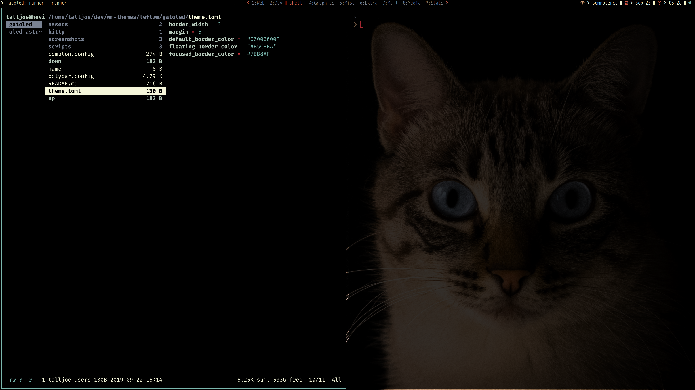

# Gatoled

A theme for OLED displays based around a kitty-cat image by [Pacto Visual
](https://unsplash.com/@pactovisual?utm_medium=referral&amp;utm_campaign=photographer-credit).

## Requirements

This theme uses [Nix](https://nixos.org/nix/) to load its dependencies. You must install the required fonts manually.

Fonts:
* [Monoid](https://larsenwork.com/monoid/)
* [Font Awesome 5](https://fontawesome.com/)

Programs:
* Kitty
* Polybar
* Compton
* LeftWM
* Fish

## Screen shots

<!-- Scratchpad
#000000
#798292
#F6F7DB
#B5C8BA
#7BB8AF
#DECB9A
#CC9E78
#5C4129
#E9B6A6
#D35F4C
#CD323D
-->